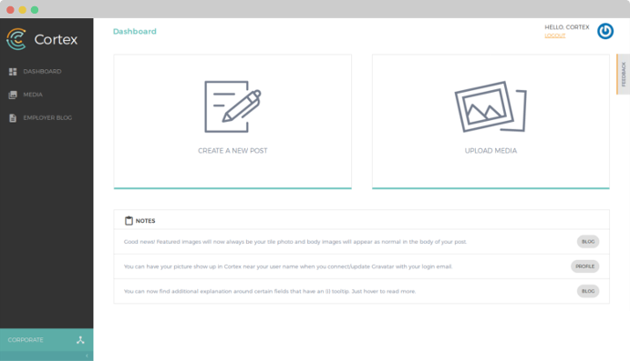

# Introduction

Cortex [CMS](glossary.md#cms) is a [multitenant](https://en.wikipedia.org/wiki/Multitenancy) identity, [custom content](glossary.md#custom-content-cms) distribution/management and reporting platform built by the [Content Enablement](https://github.com/cb-talent-development) team at [CareerBuilder](https://github.com/careerbuilder). Its purpose is to provide central infrastructure for next-generation applications; exposing a single point of management while enabling quicker build-out of new software.

Cortex adheres to a headless, API-only architecture - it avoids a monolithic, all-in-one architecture associated with CMSs like WordPress or Drupal.

To jump straight into using Cortex CMS, please refer to the [manual setup guide](basics/setup/manual-setup.md).

  

Copyright \(c\) 2018 CareerBuilder, LLC.

